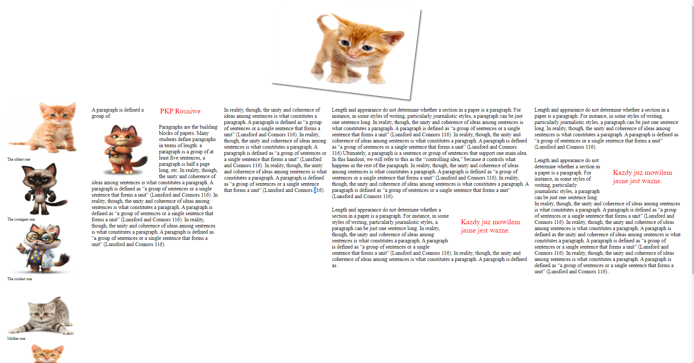
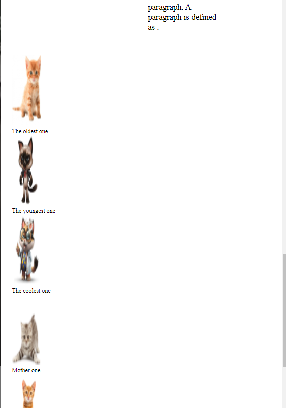
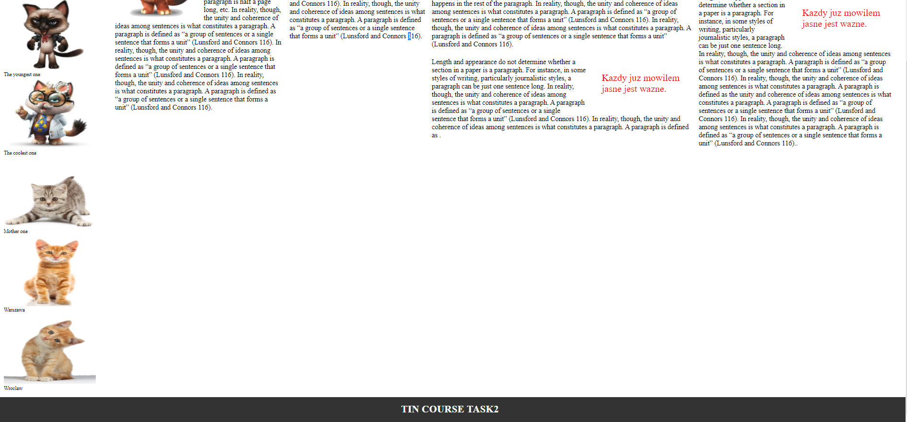

# Internet Technologies
## – Lab #3: HTML / XHTML + CSS
### Assignment A
Use Flexbox and other properties to create a webpage meeting the following requirements:
•	Header, using an image with rounded corners, rotated and casting shadow + text
•	Gallery, located on the left, containing images with captions (use tags figure and figcaption!)
•	Text on the right (at least 5-6 paragraphs) + images and pulled quotes. Text should be wrapped around images and pulled quotes. Pulled quotes should be formatted to stand out from surrounding text. Text should be divided into columns, number of columns should change dynamically depending on available space to maintain readability
•	Footer – always at the end of the document
•	Use semantic markup, remember about alt attributes
•	On devices with <800 pixels width text should be displayed in a single column, gallery should be located after text
•	(option) import two fonts, use one for headers and pulled quotes, second for main text and captions
•	Background, colors – it is up to you
•	Following pages contain example screenshots from a page meeting above requirements

### Assignment B
Build a page that meets requirements from Assignment A, but using Grid
